# RESTful
Практическая работа - RESTful веб-приложение на Spring Boot

**Цель работы** : Создать RESTful веб-приложение “Task Management System” для управления задачами с использованием Spring Boot, применяя ключевые компоненты фреймворка, включая автоматическую конфигурацию, стартеры, работу с базой данных и безопасность.

## План действий

#### 1. Создание проекта
Создала проект с помощью Spring Initializr. Скачала и импортировала проект в IntelliJ IDEA 
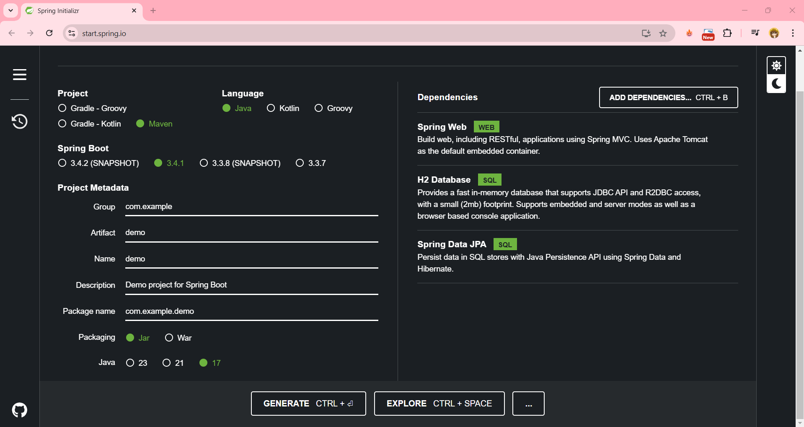

#### 2. Настройка базы данных
В src/main/resources/application.properties настроила базу данны H2 следующим образом: 
```yml
spring.application.name=demo

# Настройка подключения к базе данных H2
spring.datasource.url=jdbc:h2:mem:taskdb
spring.datasource.driver-class-name=org.h2.Driver
spring.datasource.username=sa
spring.datasource.password=password

# Включение консоли H2
spring.h2.console.enabled=true

# Настройка Hibernate
spring.jpa.hibernate.ddl-auto=update

```

#### 3. Создание модели задачи

Для начала настрола библиотеку Lombok, добавив ее в проект. Т.к. мы используем Maven, то в файл pom.xml добавила

```xml
<dependency>
    <groupId>org.projectlombok</groupId>
    <artifactId>lombok</artifactId>
    <version>1.18.30</version>
    <scope>provided</scope>
</dependency>
```

Далее в папке src/main/java/com/example/demo создала пакет model, а в этой папке создала файл Task.java с следующим содержимым:

```java
package com.example.demo.model;

import jakarta.persistence.*;
import lombok.Data;
import lombok.NoArgsConstructor;
import lombok.AllArgsConstructor;
import java.time.LocalDateTime;

@Entity
@Data
@NoArgsConstructor
@AllArgsConstructor
public class Task {
    @Id
    @GeneratedValue(strategy = GenerationType.IDENTITY)
    private Long id;

    private String title;

    private String description;

    private String status; // Например, "Pending", "In Progress", "Completed"

    private LocalDateTime createdAt;
}

```
Далее запустила приложение и убедилась, что консоль H2 доступна. 
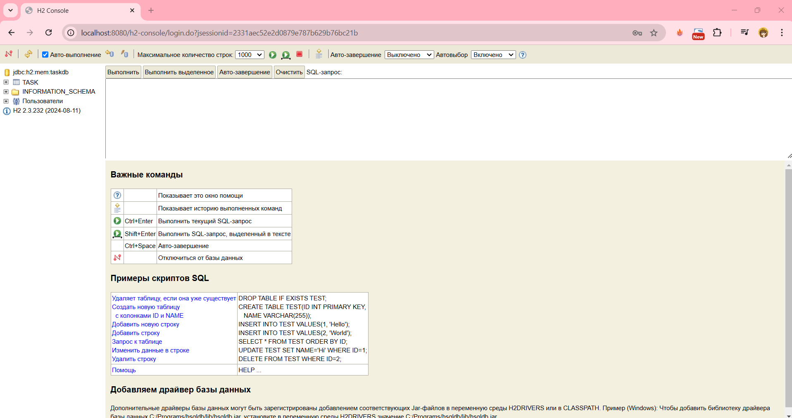

#### 4. Создание репозитория для задач

Создала файл TaskRepository.java в пакете com.example.demo.repository с следующим содержимым:

```java
package com.example.demo.repository;

import com.example.demo.model.Task;
import org.springframework.data.jpa.repository.JpaRepository;
import org.springframework.stereotype.Repository;

import java.util.List;

@Repository
public interface TaskRepository extends JpaRepository<Task, Long> {
    // Дополнительные методы для поиска (если нужно)

    // Пример: Найти задачи по статусу
    List<Task> findByStatus(String status);
}
```

#### 5. Создание REST контроллера

Аналогично предыдущим пунктам создала файл TaskController.java в пакете com.example.demo.controller с следующим содержимым:

```java
package com.example.demo.controller;

import com.example.demo.model.Task;
import com.example.demo.repository.TaskRepository;
import org.springframework.beans.factory.annotation.Autowired;
import org.springframework.web.bind.annotation.*;

import java.time.LocalDateTime;
import java.util.List;

@RestController
@RequestMapping("/api/tasks")
public class TaskController {

    @Autowired
    private TaskRepository taskRepository;

    // Получить все задачи
    @GetMapping
    public List<Task> getAllTasks() {
        return taskRepository.findAll();
    }

    // Создать новую задачу
    @PostMapping
    public Task createTask(@RequestBody Task task) {
        task.setCreatedAt(LocalDateTime.now()); // Установить дату создания задачи
        return taskRepository.save(task);
    }

    // Обновить задачу
    @PutMapping("/{id}")
    public Task updateTask(@PathVariable Long id, @RequestBody Task updatedTask) {
        return taskRepository.findById(id)
                .map(task -> {
                    task.setTitle(updatedTask.getTitle());
                    task.setDescription(updatedTask.getDescription());
                    task.setStatus(updatedTask.getStatus());
                    return taskRepository.save(task);
                })
                .orElseThrow(() -> new RuntimeException("Task not found with id " + id)); 
    }

    // Удалить задачу
    @DeleteMapping("/{id}")
    public void deleteTask(@PathVariable Long id) {
        if (!taskRepository.existsById(id)) {
            throw new RuntimeException("Task not found with id " + id);
        }
        taskRepository.deleteById(id);
    }
}

```
#### 6. Тестирование приложения

* Откройте консоль H2 по адресу /h2-console для проверки данных и выполним запрос:
  
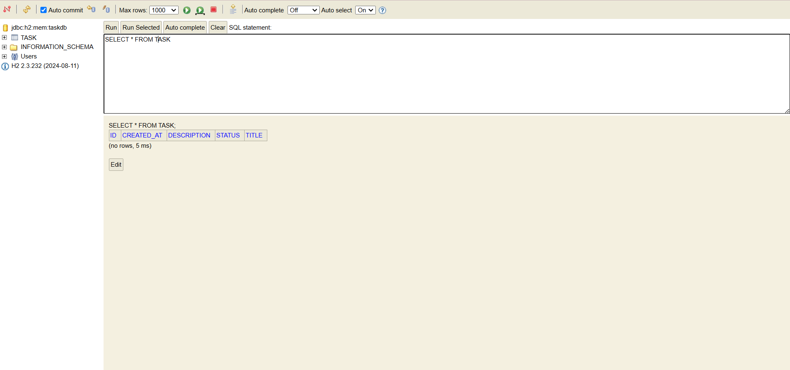

* Далее воспользуемся Postman для тестирования CRUD операций:

1. Создадим первую задачу, т.к. база пуста:

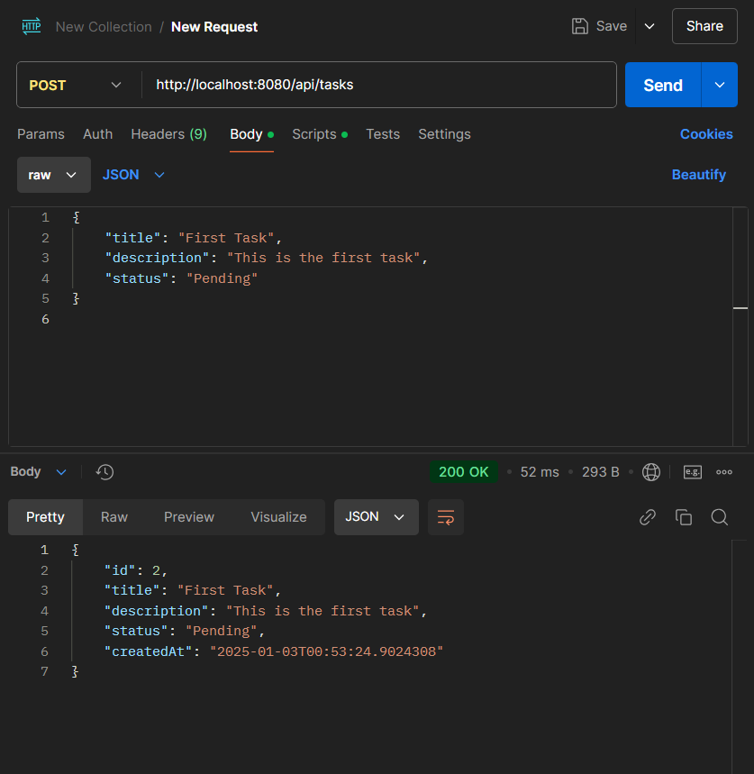
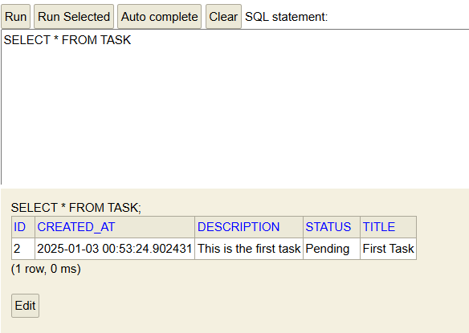

2. Получение списка задач:

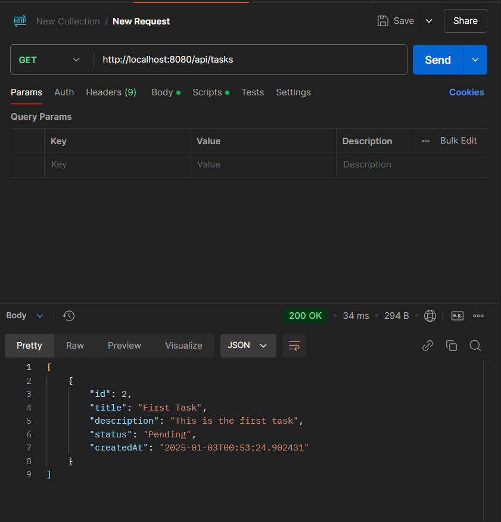

3. Создание еще одной задачи:

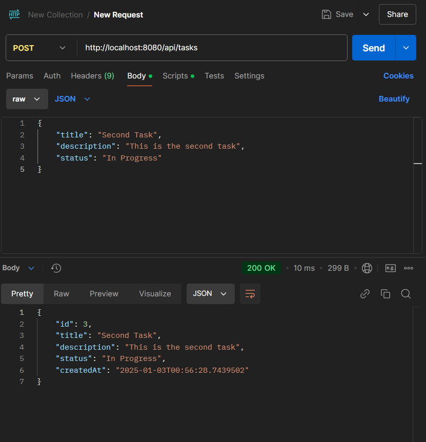
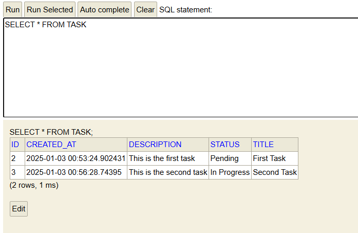

4. Обновление существующей задачи:

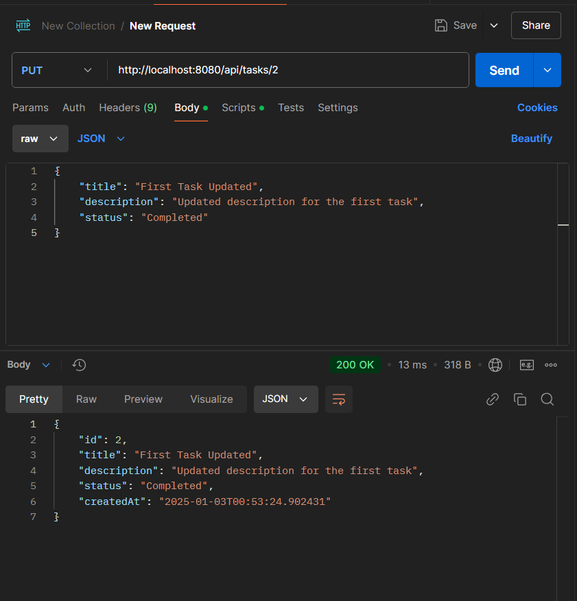
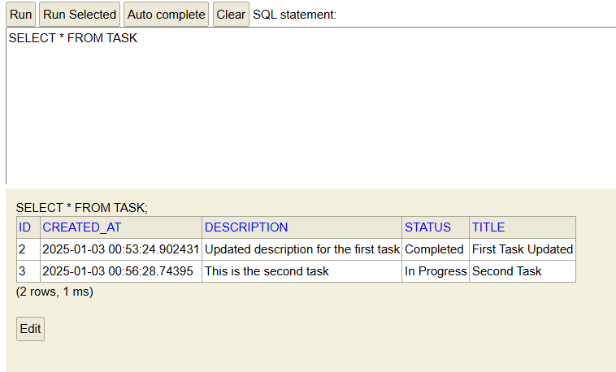

5. Удаление задачи:

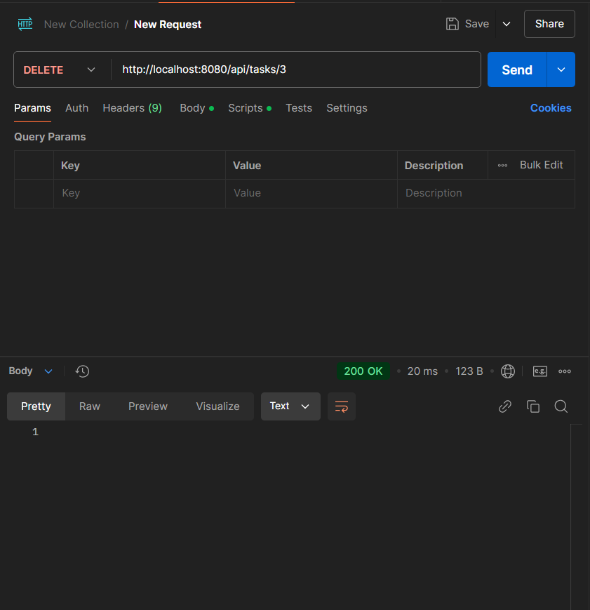
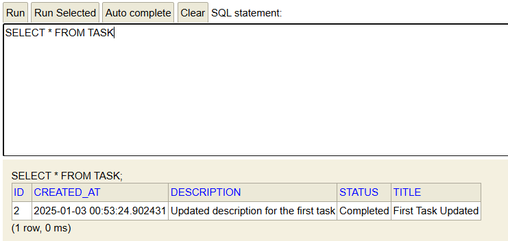

6. Проверка списка задач после удаления:

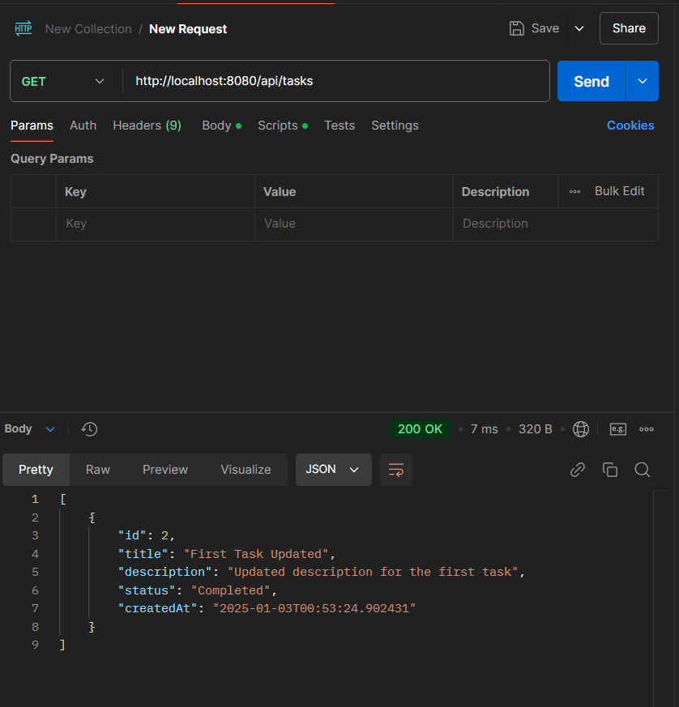

7. Получение несуществующей задачи:

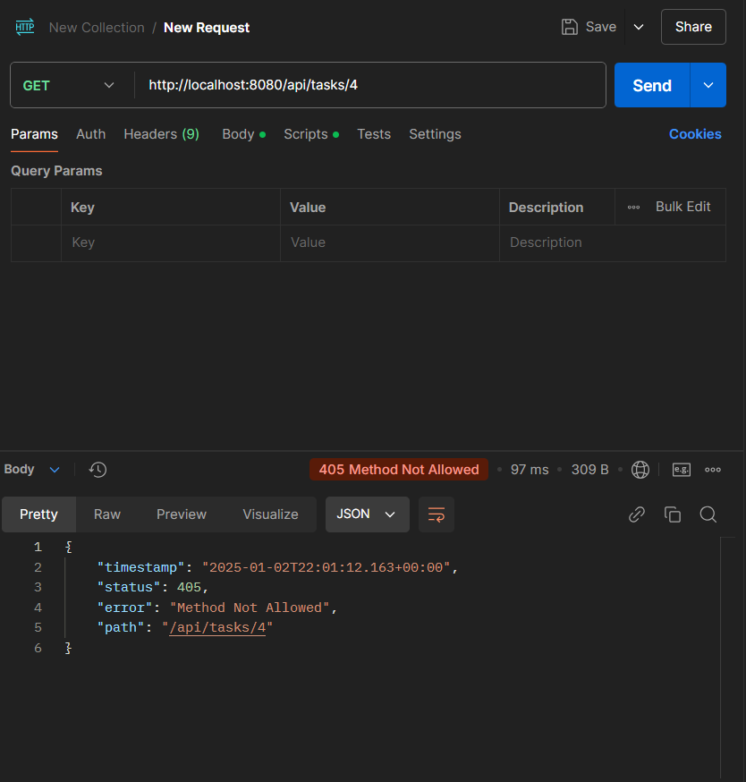
